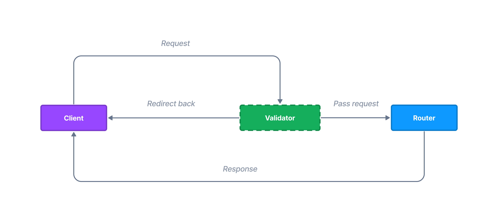

# Validation

Your app probably need some kind of form request data validation. Northle ships with a built-in validator with many useful validation rules.



## Getting Started

To be able to validate request, inject the `Validator` service into controller:

```ts{1,7}
import { Request, Validator } from '@northle/core';

@Controller()
export class PostController {
  constructor(
    private request: Request,
    private validator: Validator,
  ) {}

  // ...
}
```

## Validation Data

In order to check if request input data is valid, invoke the `assert` method. Example validation may look like this:

```ts
this.validator.assert({
  name: {
    minLength: 3,
    maxLength: 25,
  },
  age: {
    min: 18,
  },
  email: {
    email: true,
  },
});
```

If any of declared rules is not satisfied, Northle will not pass the request and `400 Bad Request` status code will be sent back along with error messages.

## Available Rules

Below you have listed all available validator rules:

```ts
interface ValidationRules {
  accepted?: boolean;
  date?: string | Date;
  doesntEndWith?: string;
  doesntStartWith?: string;
  endsWith?: string;
  email?: boolean;
  float?: boolean;
  in?: string[];
  integer?: boolean;
  ip?: boolean;
  ipv4?: boolean;
  length?: Integer;
  max?: Integer;
  maxLength?: Integer;
  min?: Integer;
  minLength?: Integer;
  notIn?: string[];
  numeric?: boolean;
  otherThan?: string;
  regexp?: RegExp;
  required?: boolean;
  sameAs?: string;
  startsWith?: string;
  username?: boolean;
}
```
