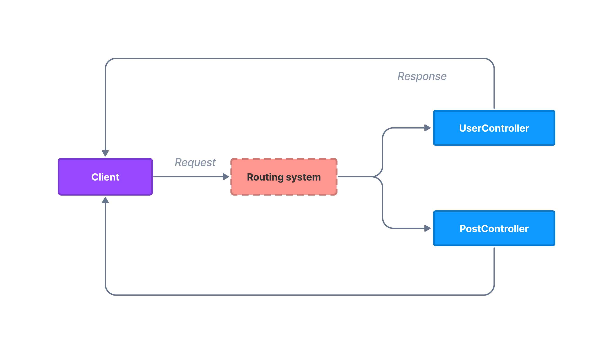

# Controllers and Routes

Typically, web applications are based on route mappings. Route, or  an endpoint is an URL with assigned function called when user asks for the URL.

Routing system in Northle is based on **controller** classes.



## Controllers

Basically, a controller is just a class with methods assigned to URLs. Each route handles incoming requests. Controllers contain methods decorated with appropriate HTTP verbs.

Northle comes with one controller in `src/app/app.controller.ts` file by default.

This controller has one registered route: `GET /`. When the user requests for that route, the request will be passed to the `index` method which renders a view.

::: code src/app/app.controller.ts
```ts
import { Controller, Handler, Request, Route, view } from '@northle/core';

@Controller()
export class AppController {
  constructor(private handler: Handler, private request: Request) {}

  @Route.Get('/')
  public index() {
    return view('./views/home', {
      message: 'Welcome',
    });
  }

  @Route.Error(404)
  public notFound() {
    this.handler.useDefaultNotFound();
  }
}
```
:::

Controller methods should always return some value. Northle automatically sends proper headers based on returned data. In case of object or array, the response has the JSON type. When returned value is text or a view object, it will be rendered as HTML.

### Registering controllers

The place where every controller is registered is a [module](/docs/basics/modules). Every time you create a new controller manually, you need to import it into a module:

::: code src/posts/post.module.ts
```ts
import { Module } from '@northle/core';
import { PostController } from './post.controller';// [!code ++]

@Module({
  controllers: [
    PostController,// [!code ++]
  ],
})
export class PostModule {}
```
:::

Then register it in `src/main.ts` file:

::: code src/main.ts
```ts
import { PostModule } from './posts/post.module';// [!code ++]

const server = await createServer({
  // ...

  modules: [
    AppModule,
    PostModule,// [!code ++]
  ],
});
```
:::

## Routes

In order to declare application routes, add new controller method and decorate it with a proper HTTP verb decorator:

::: code src/app/app.controller.ts
```ts
import { Controller, Route } from '@northle/core';

@Controller()
class AppController {
  // ...

  @Route.Get('/users')
  public index() {
    // ...
  }

  @Route.Post('/users')
  public store() {
    // ...
  }

  @Route.Delete('/users/:id')
  public destroy() {
    // ...
  }
}
```
:::

::: tip NOTE
Controller methods should be as short as possible - they are only responsible for handling web requests and returning a response. For more logic you can familiarize yourself with service classes.
:::

### URL patterns

Routes in Northle are dynamic. That means you can use the `:param` syntax to declare a variable URL that accepts multiple values:

```ts
// Match paths like `/users/james_bond` or `/users/andrei_sator`
@Route.Get('/users/:name')
```

### Optional parameters

To make a paramater optional, use the question mark. The following route will match both `/users` and `/users/luke_skywalker` paths:

```ts
@Route.Get('/users/:name?')
```

### Regular expressions

You can also define a `RegExp` pattern for route parameters:

```ts
// This route will accept only numeric params
@Route.Get('/posts/:id(^\\d+)')

// This route will accept IDs in form `aaa-bbb`
@Route.Get('/users/:id(^\\d{3}-\\d{3})')
```

## Error handler routes

A typical Northle application often returns errors like `404 Not Found` or `500 Internal Server Error`. The framework exposes a simple API for custom error handling logic.

You can customize the `404` page by adding a special `Error` route:

::: code src/app/app.controller.ts
```ts
@Controller()
class AppController {
  // ...

  @Route.Error(404)// [!code ++]
  public notFound() {// [!code ++]
    return view('./views/404');// [!code ++]
  }// [!code ++]
}
```
:::

## Response types

Northle automatically discovers response type based on the returned value from the controller.

```ts
// JSON response (text/json) MIME type
return {
  name: 'Bond. James Bond',
};
```

```ts
// JSON response (text/json) MIME type
return [1, 2, 3];
```

```ts
// HTML response (text/html) MIME type
return '<h1>Hello World</h1>';
```

```ts
// HTML response
return view('./views/profile');
```

```ts
// Redirect response
return redirect('/login');
```

To get more information about response types, visit the [responses](/docs/basics/responses) section.
