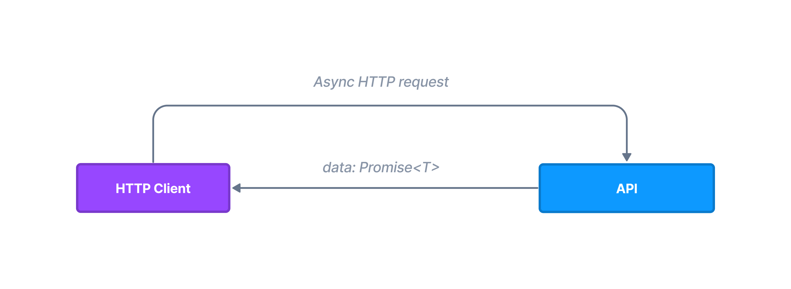

# HTTP Client

Web applications often need to fetch some data by HTTP requests. Northle ships with a handy `HTTP Client` service that helps creating API requests.



## Get started

To get started with the client, import and inject `HttpClient` service to the controller or other service:

::: code src/movies/movie.controller.ts
```ts
import { HttpClient } from '@northle/core';// [!code ++]

@Controller()
export class MovieController {
  constructor(private http: HttpClient) {}// [!code ++]
}
```
:::

## Making requests

To fetch some data from an endpoint use one of available HTTP methods (`get`, `patch`, `post`, `put`, `options`, `trace`, `head`, and `delete`):

::: code src/movies/movie.controller.ts
```ts{3}
const apiUrl = 'https://movie-api.com/movies';

const movies = await this.http.get<Movie[]>(apiUrl);
```
:::

All these methods are generic so you can specify response type:

::: code src/movies/movie.controller.ts
```ts
interface Movie {
  title: string;
  url: string;
  duration: number;
}

await this.http.get<Movie[]>(apiUrl);
```
:::

::: tip NOTE
Response type declaration is only build-time check so you should handle errors in case the response is invalid.
:::
