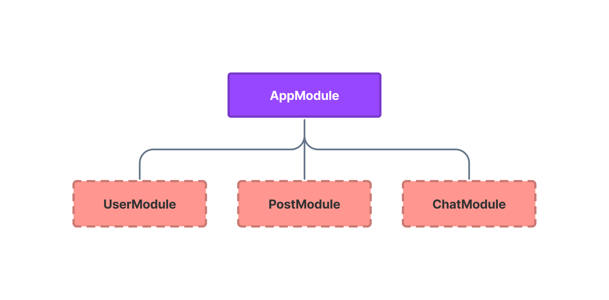

# Modules

The most basic piece of Northle application are modules. Module is a simple class responsible for organizing code and dividing it into smaller chunks. Each module should represent one app feature.



## Module Structure

Each module has a similar structure:

::: code src/posts/post.module.ts
```ts
import { Module } from '@northle/core';

@Module({
  controllers: [],
  socketChannels: [],
})
export class PostModule {}
```
:::

The `controllers` field defines a list of HTTP [controllers](/docs/basics/controllers-and-routing) associated with the module. This is required for proper route registering.

Likewise, the `socketChannels` array declares websocket [channels](/docs/advanced/websockets).

Therefore, every time you create new controller or socket channel, you have to import and declare these classes in the proper field, for example:

::: code src/chat/chat.module.ts
```ts{2,3,7,10}
import { Module } from '@northle/core';
import { ChatController } from './chat.controller';
import { ChatChannel } from './chat.channel';

@Module({
  controllers: [
    ChatController,
  ],
  socketChannels: [
    ChatChannel,
  ],
})
export class ChatModule {}
```
:::

## Module Registration

Every module should be registered in the `src/main.ts` file like so:

::: code src/main.ts
```ts{1,2,8,9}
import { AppModule } from './app/app.module';
import { ChatModule } from './chat/chat.module';

const server = await createServer({
  // ...

  modules: [
    AppModule,
    ChatModule,
  ],
});
```
:::
