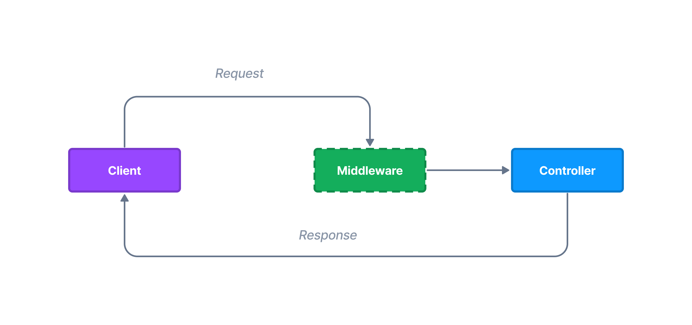

# Requests

Northle provides a fluent API for dealing with web requests. The framework provides several ways to return responses. Each client request is represented by `Request` object.



## Request objects

To start using response API, inject the `Request` service by type-hinting it:

::: code src/posts/post.controller.ts
```ts
import { Controller, Request } from '@northle/core'; // [!code ++]

@Controller()
class PostController {
  constructor(private request: Request) {} // [!code ++]
}
```
::

## Request methods

Northle supports all available HTTP verbs for handling web requests along with [WebDAV](https://www.ibm.com/docs/en/i/7.1?topic=concepts-webdav) methods.

| HTTP Method   | Role                          |
| ------------- | ----------------------------- |
| COPY          | Copy the resource             |
| DELETE        | Delete the resource           |
| GET           | Get the resource content      |
| HEAD          | Get request headers           |
| LOCK          | Lock the resource             |
| MKCOL         | Create resource collection    |
| MOVE          | Move the resource             |
| OPTIONS       | Get server options            |
| POST          | Post a resource               |
| PROPFIND      | Find resource property        |
| PROPPATCH     | Edit resource property        |
| PATCH         | Update the resource partially |
| PUT           | Update the resource           |
| TRACE         | Perform a trace call          |
| UNLOCK        | Unlock the resource           |

## Route parameters

To get matched route URL parameters, use `request.params` property:

::: code src/posts/post.controller.ts
```ts{4,6}
class PostController {
  // ...

  @Route.Get('/users/:id')
  public show() {
    const { id } = this.request.params;

    return `User id: ${id}`;
  }
}
```
:::

Alternatively you can read parameter values using method params:

::: code src/posts/post.controller.ts
```ts{5}
class PostController {
  // ...

  @Route.Get('/users/:id')
  public show(id: string) {
    // ...
  }
}
```
:::

## Query string params

In order to get URL query string entries, use the `request.query` property:

```ts
// URL: /search?name=riddler
const { name } = this.request.query;  // 'riddler'
```

## Headers

To get request headers, use the `header` method:

```ts
const header = this.request.header('x-requested-with');
```

## Cookies

To read cookies sent by the user, use the `request.cookies` property:

```ts
const { darkMode } = this.request.cookies;
```

## Form input data

To retrieve and process incoming form data, use the `request.data` property:

::: code src/users/user.controller.ts
```ts{6}
class UserController {
  // ...

  @Route.Post('/users')
  public async store() {
    const { username, password } = this.request.data;

    await this.db.user.create({
      // ...
    });
  }
}
```
:::

## Detecting AJAX requests

You may check if request was made by AJAX (AJAX requests should have set `x-requested-with` header with `XMLHttpRequest` value):

```ts
if (!this.request.ajax()) {
  return 'This route only accepts AJAX requests';
}
```

## Locale

To get client's locale use the `locale` method:

```ts
// 'en', 'pl' etc.
const locale = this.request.locale();
```

Read more about [localization](/docs/advanced/localization) and language features.

## Method spoofing

When you're building a RESTful API, you may encounter a problem - HTML forms don't support HTTP methods other than `GET` and `POST`.

Northle lets you to use these methods thanks to `[method]` template directive. Just pass a method name and you'll be able to use methods like `PATCH` and `DELETE` in HTML forms (it's called method spoofing):

::: code src/posts/views/upload.html
```html
<form action="/login" method="post">
  [method('PATCH')]

  ...
</form>
```
:::

::: tip NOTE
Note that the form must include `method="post"` attribute to work.
:::
