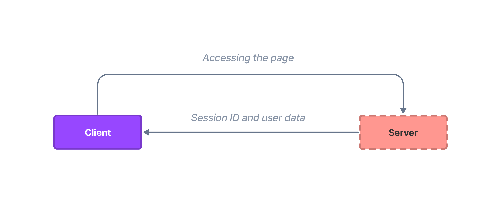

# Session

Since HTTP protocol is stateless, we cannot share data between requests. On backend there is a term of **session** - a mechanism which can store user information that we can access on multiple requests.

Northle provides a built-in session management system so you don't have to install any additional dependencies.



## Getting started

To start using session just import it and inject from the service container:

::: code src/users/user.controller.ts
```ts
import { Session } from '@northle/core';// [!code ++]

@Controller()
export class UserController {
  constructor(private session: Session) {}// [!code ++]
}
```
:::

Then you'll be able to use the session object in your controller.

## Storing data

To save a variable to the session, use the `set` method:

```ts
const user = await this.db.user.findUnique(id);

this.session.set('email', user.email);
```

## Flash data

In order to set temporary data which is deleted when you access it, use the `flash` method:

```ts
this.session.flash('error', 'Invalid e-mail or password');
```

## Retrieving data

For obtaining saved session data you have a `session.data` object available:

```ts
const email = this.session.data.email;
```

Alternatively you can use the `session` helper:

```ts
import { session } from '@northle/core';

const email = session('email');
```

You may also access flashed data with the `flash` helper:

```ts
import { flash } from '@northle/core';

const error = flash('error');
```

## Deleting data

To remove items from the session, call `delete` method:

```ts
this.session.delete('email');
```

## Destroying session

Sometimes you need to clear all session entries and completely unset the session, for example for logging out the user. In order to do that, use the `destroy` method:

```ts
this.session.destroy();
```
